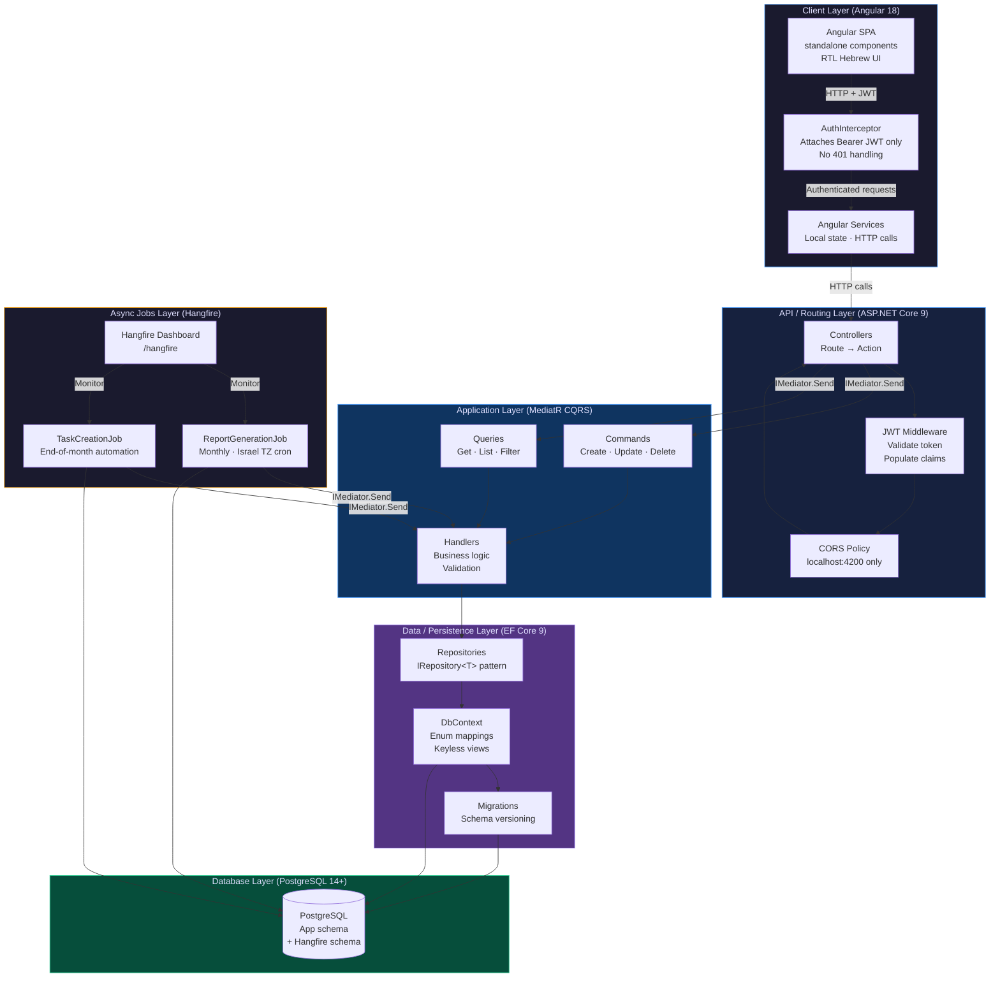

# Accounting Office Management System
Full-stack workflow platform for Hebrew-speaking Accounting Office Management System - Angular 18 SPA, ASP.NET Core 9 API, PostgreSQL, Hangfire.

---

## Highlights

- **Clean Architecture + CQRS** - strict four-layer dependency direction enforced by project references; all write and read paths flow through MediatR handlers.
- **Angular 18 standalone components** - no NgModules, no centralized state store; RTL Hebrew UI throughout.
- **JWT authentication + Google OAuth** - token-based auth with a dedicated interceptor that attaches Bearer credentials on every outbound request.
- **Hangfire recurring jobs** - end-of-month report generation scheduled with Israel-timezone cron expressions, sharing the application's PostgreSQL instance (no external broker).
- **EF Core 9** - enum mappings and keyless-view projections keep persistence concerns out of the domain model.
- **Modular monolith** - single deployable, one database, one operational surface; dependency direction strictly inward.

---

## Key Features

- Recurring report lifecycle - status progresses through Pending, Reported, Paid, and Approved with enforced transitions.
- Automatic monthly task generation - Hangfire fires at end-of-month on the Israeli business calendar and creates tasks for every active assignment.
- Worker/company assignment workflow - coordinators assign workers to client companies and track completion state per cycle.
- Full audit log - every mutation records who changed what and when.
- Role-based access - route guards and component-level checks enforce authorization in the Angular SPA.
- Hebrew RTL UI - all screens are right-to-left first; layout, typography, and form direction are set globally.
- Background processing - end-of-month operations run asynchronously and do not block API responses.

---

## Overview

### Why this project exists

This system was developed for a real accounting office that managed recurring monthly workflows manually through spreadsheets and email threads. Tasks such as report generation, payment tracking, worker coordination, and audit logging were handled through fragmented processes that were slow to execute and difficult to track consistently.

The platform centralizes the entire workflow into a single Hebrew RTL web application, allowing office staff to manage recurring operations, monitor task progress, and maintain a reliable audit trail from one system.

The technical shape is a standard three-tier web application with disciplined backend layering. An Angular 18 single-page application communicates with an ASP.NET Core 9 REST API structured as a Clean Architecture modular monolith. Controllers delegate requests to MediatR handlers, handlers own business logic, repositories manage persistence, and EF Core 9 interacts with PostgreSQL. A Hangfire scheduler runs within the same process and database, triggering recurring monthly automation jobs without requiring external infrastructure.

---

## Technical Challenges

- **Timezone-aware recurring scheduling** - the `ReportGenerationJob` cron expression is configured for Israel time, so end-of-month tasks fire on the local business calendar regardless of the server's system timezone.
- **Lightweight frontend state without NgRx** - services hold local state directly; no centralized store is introduced, which keeps the component graph shallow and the wiring easy to follow.
- **Strict dependency direction in a modular monolith** - Domain has zero outward references; Application depends only on Domain; Infrastructure and API depend on both. This is enforced by .NET project references, not by convention alone.
- **Shared PostgreSQL for application data and Hangfire job state** - a single connection string covers both EF Core migrations and the Hangfire schema, eliminating the need for a separate message broker or job-state database at this scale.

---

## Architecture

Requests travel through six layers: the Angular client sends authenticated HTTP requests to the ASP.NET Core routing layer; controllers forward commands and queries to MediatR; handlers in the Application layer carry out business logic through repository interfaces; repositories in the Infrastructure layer translate those calls into EF Core operations against PostgreSQL. Hangfire jobs share the same Application layer - they invoke the same handlers that HTTP requests use, so business logic is never duplicated. The concrete request path is: `Controller → IMediator.Send → Handler → Repository → DbContext → PostgreSQL`.



---

## Architectural Decisions

The following trade-offs were chosen intentionally to match project scale and operational simplicity:

- **Modular monolith over microservices** - a single deployable artifact means one database, one operational surface, and no distributed-systems overhead at this scale.
- **Hangfire over external queue infrastructure** - using the same PostgreSQL eliminates RabbitMQ, Azure Service Bus, or any other broker; one fewer moving part to run and monitor.
- **CQRS via MediatR** - write and read paths are cleanly separated without introducing an event bus or a read replica; the handler boundary alone is sufficient here.
- **Angular standalone components (no NgModules)** - aligns with the modern Angular direction post-v15 and keeps feature wiring shallow.
- **Shared PostgreSQL for application and Hangfire** - one connection string, one backup target, one migration surface.

---

## Usage

Start the backend (from `Backend/AccountingSystem/`):

```powershell
dotnet run
# or for HTTPS
dotnet run --launch-profile https
```

Start the frontend (from `Fronted/Angular-app/`):

```powershell
npm start
```

| Endpoint | URL |
|---|---|
| Angular SPA | http://localhost:4200 |
| Swagger (API docs) | http://localhost:{port}/swagger |
| Hangfire dashboard | http://localhost:{port}/hangfire |

---

## Installation

**Prerequisites:** .NET 9 SDK, Node 18+ / npm 10+, PostgreSQL 14+.

1. Clone the repository:
   ```bash
   git clone <repo-url>
   cd <repo-root>
   ```

2. Configure environment variables:
   ```bash
   cp Backend/AccountingSystem/.env.example Backend/AccountingSystem/.env
   # Open .env and fill in all values (database connection string, JWT secret, Google OAuth credentials, etc.)
   ```

3. Restore the database schema by running the SQL script at the repo root - the file is named `Script.sql`. Execute it against your PostgreSQL instance before starting the API.

> **Note:** The backend CORS policy hard-codes `http://localhost:4200` and `https://localhost:4200` as the allowed origin. If you change the Angular dev server port, update the corresponding entry in `Backend/AccountingSystem/Program.cs`.

---

## Screenshots

| Screen             | Preview                                                                                                                                 |
| ------------------ | --------------------------------------------------------------------------------------------------------------------------------------- |
| Reports management |  |
| Reports Settings   |  |
| Task Template      |   |

---

## Project Structure

```
/
├── Backend/
│   └── AccountingSystem/          # ASP.NET Core 9 solution
│       ├── .env.example           # Environment variable template
│       └── .claude/CLAUDE.md      # Backend conventions & architecture notes
├── Fronted/
│   └── Angular-app/               # Angular 18 SPA
│       └── CLAUDE.md              # Frontend conventions & component patterns
├── Script.sql                  # Initial database schema 
└── CLAUDE.md                      # Root-level project conventions
```

Contributors should read the relevant CLAUDE.md before making changes:

- Backend: `Backend/AccountingSystem/.claude/CLAUDE.md`
- Frontend: `Fronted/Angular-app/CLAUDE.md`

---

## Future Improvements

The following are realistic next steps, none of which exist in the repository today:

- **Docker Compose** - a single `docker-compose.yml` for one-command local bring-up (PostgreSQL + API + Angular dev server).
- **Redis caching** - reduce database load on heavy list queries (reports grid, task list) with a distributed cache layer.
- **Integration test suite** - the project currently has no automated tests; an xUnit + Testcontainers suite would cover the CQRS handlers end-to-end.
- **Dedicated Hangfire worker process** - split the scheduler into a separate .NET Worker Service so background jobs can be scaled or deployed independently of the HTTP API.
- **CI/CD pipeline** - GitHub Actions workflow for lint, build, and (once tests exist) test runs on every push to main.

---

## Contributing & Feedback

Open a GitHub issue or pull request. Before contributing, read the CLAUDE.md files for the relevant sub-project - they document the conventions that govern this codebase:

- English-only code, comments, and commit messages (the product UI is Hebrew; the codebase is English).
- No rewrites of existing subsystems without explicit prior approval.
- RTL-first UI: all new Angular components must work correctly in a right-to-left layout before considering left-to-right.
- No emojis in code, comments, or commit messages.


---

## License

This repository is shared for portfolio and evaluation purposes. Commercial reuse is not permitted.
